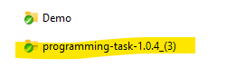
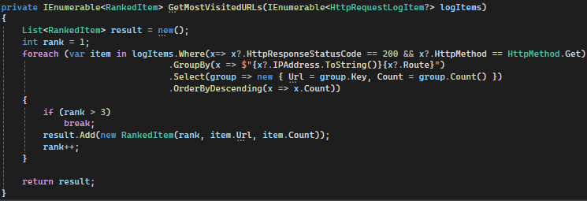
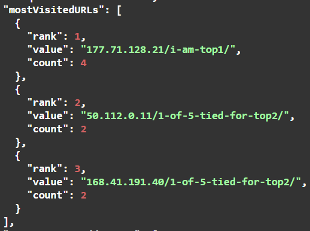
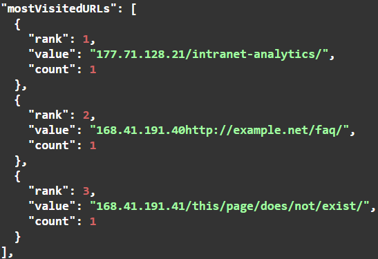
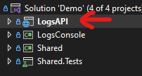
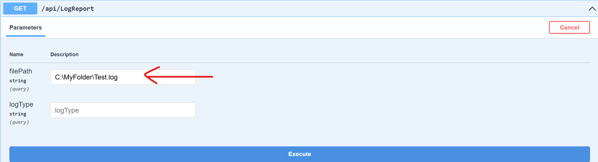
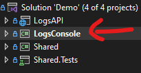
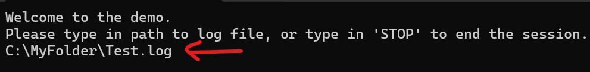

# About The Project

This is a demo application for Mantel Group that parses a log file containing HTTP requests and generates a report containing the following items below.
<ul>
	<li>The number of unique IP addresses</li>
	<li>The top 3 most visited URLs</li>
	<li>The top 3 most active IP addresses</li>
</ul>

Mantel Group has provided a sample log file inside programming-task-1.0.4.zip file included in project source code.

## Source Code
The source code to the demo application is available in 2 ways:
1. Zip file sent via email to Emily Millard ( emily.millard@mantelgroup.com.au )
2. [Github](https://github.com/orvinjedalava/Demos)

# Assumptions
## Assumption 1 - Generating the TOP URLs and IP Addresses.
Ranking logic is implemented by using a simple GroupBy-OrderByDescending LINQ statement. No special logic introduced to deal with "ties" in the top results. 

For example, if the log file contains 5 URL's tied for top-2, the report will show the top-1 URL as expected, and the top-2 and top-3 may display any of the the tied items.  

## Assumption 2 - URL Value
The application performs a straightforward concatenation of IP Address and Route values to generate a URL, regardless if the resulting value is a valid URL format or not.

## Assumption 3 - Visited URL
The application considers a URL as "visited" if it passes the 2 conditions below:
1. Status Code is 200
2. Http Method is GET

# How to Use the Application

## Option 1 - Swagger Page
1. Go to Demos -> Mantel ->  Demo
2. Open Demo.sln in Visual Studio ( I created the project using Microsoft Visual Studio Community 2022 - version 17.10.3 )
3. Go to Build menu -> Build Solution  
4. Right click LogsAPI project -> Set as Startup Project

5. Go to Debug menu -> Either "Start Debugging" or "Start Without Debugging" 
6. When Swagger page is loaded, expand "api/LogReport" -> Click "Try it out"
7. Inside filePath parameter control, type in the absolute file path of the log file you want to test  

8. Click "Execute" button to generate the report

## Option 2 - Console Application
1. Go to Demos -> Mantel ->  Demo
2. Open Demo.sln in Visual Studio ( I created the project using Microsoft Visual Studio Community 2022 - version 17.10.3 )
3. Go to Build menu -> Build Solution  
4. Right click LogsConsole project -> Set as Startup Project

5. Go to Debug menu -> Either "Start Debugging" or "Start Without Debugging" 
6. When Console Window runs, type the absolute file path of the log fileyou want to test

7. Press Enter